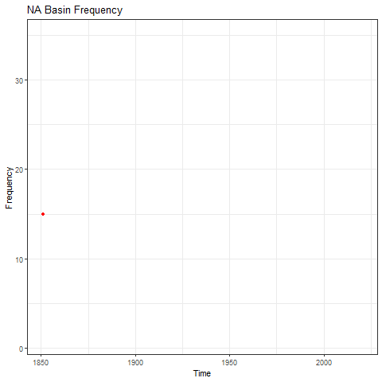

# cyclone
This package includes data analyses of tropical cyclone tracks in the N. Atlantic basin. Tabular data is utilized to calculate the intensity and frequency of cyclones from 1850 to present (In Progress).

# Data
IBTrACS - National Climate Data Center -NOAA

# Vignettes
The following vignettes are included in this repository:

  Data_Download.Rmd
  cyclone_analysis.Rmd
  Data_Visualization.Rmd

# Results
Sample of results. Additional basins also include intensity and frequency results over different temporal scales.

